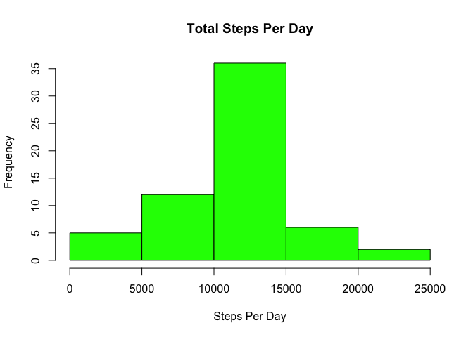

# Reproducible Research: Peer Assessment 1


## Loading and preprocessing the data


```r
#Load data that is saved in the Working Directory

activity<-read.csv("activity.csv",stringsAsFactors=FALSE)

#Transforming date from character and integer variables to numeric for ease of calculations
activity$date<-as.Date(activity$date)
activity$steps<-as.numeric(activity$steps)
activity$interval<-as.numeric(activity$interval)
```

## What is mean total number of steps taken per day?


```r
#Calculating total number of steps per day

# Removing the Missing values while calculating total, as per instructions missings to be ignored

library(dplyr)
```

```
## 
## Attaching package: 'dplyr'
## 
## The following object is masked from 'package:stats':
## 
##     filter
## 
## The following objects are masked from 'package:base':
## 
##     intersect, setdiff, setequal, union
```

```r
StepsPerDay<-summarise(group_by(activity,date),
                       totalStepsPerDay=sum(steps,na.rm=TRUE))

# Histogram of the total number of steps taken each day

hist(StepsPerDay$totalStepsPerDay,col="Red",main='Total Steps Per Day',
     xlab='Steps Per Day',ylab='Frequency' )
```

 

```r
#Mean and MEdian of Total Steps per Day,  Removing the Missing values while calculating mean/median
meanStepsPerDay<- mean(StepsPerDay$totalStepsPerDay,na.rm=TRUE)
medianStepsPerDay<- median(StepsPerDay$totalStepsPerDay,na.rm=TRUE)

meanStepsPerDay
```

```
## [1] 9354.23
```

```r
medianStepsPerDay
```

```
## [1] 10395
```

## What is the average daily activity pattern?


```r
#No. of steps per 5-minute interval across all days
meanStepsPerInterval<-summarise(group_by(activity,interval),
                            meanStepsPerInt=mean(steps,na.rm=TRUE))

# Plotting the Average steps per interval
with(meanStepsPerInterval,plot(interval,
                               meanStepsPerInt,
                               type='l',
                               ylab='Average steps per Interval',
                               xlab='Intervals'))
```

 

```r
#Which 5-minute interval, on average across all the days in the dataset, contains the maximum number of steps?

subset(meanStepsPerInterval$interval,meanStepsPerInterval$meanStepsPerInt==max(meanStepsPerInterval$meanStepsPerInt))
```

```
## [1] 835
```

```r
#08:35 is the max interval
```

## Imputing missing values

```r
#NAs in the dataset
sum(is.na(activity))
```

```
## [1] 2304
```

```r
#Merging the average steps per interval from a previous step
activity2<-merge(x = activity,    y = meanStepsPerInterval,    by = "interval", all.x=TRUE)

#Imputing the missing values in steps with the mean steaps per interval 
activity2$steps_meanimputed<-ifelse(is.na(activity2$steps),activity2$meanStepsPerInt,activity2$steps)

#Create new dataset replacing the old steps column with mean-imputed steps column
activity2<-activity2[,c(5,3,1)]
names(activity2)<-c("steps","date","interval")

#Histogram after the mean imputation

StepsPerDay2<-summarise(group_by(activity2,date),
                       totalStepsPerDay2=sum(steps,na.rm=TRUE))
head(StepsPerDay2)
```

```
## Source: local data frame [6 x 2]
## 
##         date totalStepsPerDay2
## 1 2012-10-01          10766.19
## 2 2012-10-02            126.00
## 3 2012-10-03          11352.00
## 4 2012-10-04          12116.00
## 5 2012-10-05          13294.00
## 6 2012-10-06          15420.00
```

```r
summary(StepsPerDay2)
```

```
##       date            totalStepsPerDay2
##  Min.   :2012-10-01   Min.   :   41    
##  1st Qu.:2012-10-16   1st Qu.: 9819    
##  Median :2012-10-31   Median :10766    
##  Mean   :2012-10-31   Mean   :10766    
##  3rd Qu.:2012-11-15   3rd Qu.:12811    
##  Max.   :2012-11-30   Max.   :21194
```

```r
hist(StepsPerDay2$totalStepsPerDay2,col="Green",main='Total Steps Per Day',
     xlab='Steps Per Day',ylab='Frequency' )
```

 

```r
#Mean and MEdian of Total Steps per Day
meanStepsPerDay2<- mean(StepsPerDay2$totalStepsPerDay2,na.rm=TRUE)
medianStepsPerDay2<- median(StepsPerDay2$totalStepsPerDay2,na.rm=TRUE)

meanStepsPerDay2
```

```
## [1] 10766.19
```

```r
medianStepsPerDay2
```

```
## [1] 10766.19
```

## Are there differences in activity patterns between weekdays and weekends?

```r
library(ggplot2)
```

```
## Warning: package 'ggplot2' was built under R version 3.1.3
```

```r
#Weekdays/Weekend analyses

activity2$wkday<-weekdays(activity2$date)

#weekday or weekday
activity2$daytype<-as.factor(ifelse(activity2$wkday %in% c("Saturday","Sunday"),"weekend","weekday"))

AvgStepsPerInterval<-summarise(group_by(activity2,daytype,interval),
                        AvgStepsPerInt=mean(steps,na.rm=TRUE))

f1<-ggplot(data=AvgStepsPerInterval,aes(x=interval,y=AvgStepsPerInt)) + geom_line()
f2<-f1+facet_grid(daytype~.)
f3<-f2+labs(x="Interval",y="Average Steps by Interval",title="Comparing Average Steps per Interval by Weeday/Weekend")

f3
```

 
###Higher averages in the Weekends are more generally but mornings are higher for weekdays
