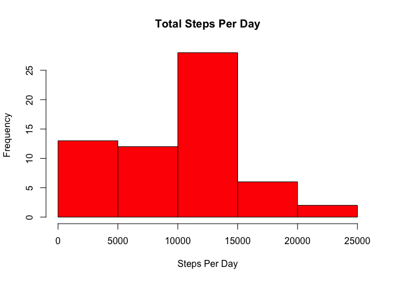
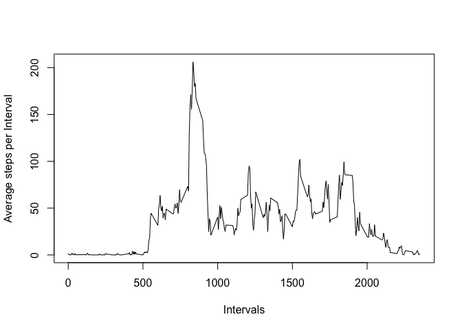

# Reproducible Research: Peer Assessment 1


## Loading and preprocessing the data


```r
#Load data that is saved in the Working Directory

activity<-read.csv("activity.csv",stringsAsFactors=FALSE)

#Transforming date from character and integer variables to numeric for ease of calculations
activity$date<-as.Date(activity$date)
activity$steps<-as.numeric(activity$steps)
activity$interval<-as.numeric(activity$interval)
```

## What is mean total number of steps taken per day?


```r
#Calculating total number of steps per day

# Removing the Missing values while calculating total, as per instructions missings to be ignored

library(dplyr)
```

```
## 
## Attaching package: 'dplyr'
## 
## The following object is masked from 'package:stats':
## 
##     filter
## 
## The following objects are masked from 'package:base':
## 
##     intersect, setdiff, setequal, union
```

```r
StepsPerDay<-summarise(group_by(activity,date),
                       totalStepsPerDay=sum(steps,na.rm=TRUE))

# Histogram of the total number of steps taken each day

hist(StepsPerDay$totalStepsPerDay,col="Red",main='Total Steps Per Day',
     xlab='Steps Per Day',ylab='Frequency' )
```

 

```r
#Mean and MEdian of Total Steps per Day,  Removing the Missing values while calculating mean/median
meanStepsPerDay<- mean(StepsPerDay$totalStepsPerDay,na.rm=TRUE)
medianStepsPerDay<- median(StepsPerDay$totalStepsPerDay,na.rm=TRUE)

meanStepsPerDay
```

```
## [1] 9354.23
```

```r
medianStepsPerDay
```

```
## [1] 10395
```

## What is the average daily activity pattern?


```r
#No. of steps per 5-minute interval across all days
meanStepsPerInterval<-summarise(group_by(activity,interval),
                            meanStepsPerInt=mean(steps,na.rm=TRUE))

# Plotting the Average steps per interval
with(meanStepsPerInterval,plot(interval,
                               meanStepsPerInt,
                               type='l',
                               ylab='Average steps per Interval',
                               xlab='Intervals'))
```

 

```r
#Which 5-minute interval, on average across all the days in the dataset, contains the maximum number of steps?

subset(meanStepsPerInterval$interval,meanStepsPerInterval$meanStepsPerInt==max(meanStepsPerInterval$meanStepsPerInt))
```

```
## [1] 835
```

```r
#08:35 is the max interval
```

## Imputing missing values


## Are there differences in activity patterns between weekdays and weekends?
